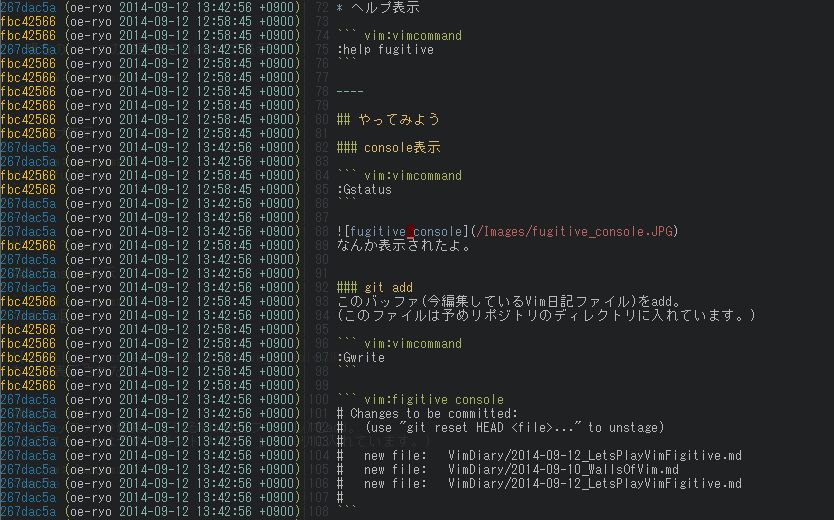
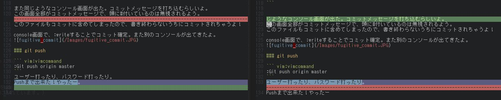

# 2014-09-16 Gitの機能をvim-fugitiveで確認しよう 

前回紹介したvim-fugitiveのコマンドのうち、使用しなかったコマンドを使ってみようのコーナーです。
なお、Vimを介さないなGitコンソールコマンドはそのままのコマンドで使えるよう。(initとか。)


## Diff

``` vim:vimcommand
:Gwrite
```

## 現在開いているソースの直前のコミット時のソースを表示

``` vim:vimcommand
:Gread
``` 

これはfugitive固有の機能っぽい。なにも考えずに実行すると問答無用で直前コミット状態に戻される。差分表示とかではない…
引数使うとなんかもっと有効にできそうな気もしたので、ファイル名とか付けてみたけど駄目。
調べればなんか出てくるだろうけど、
今のところは「元に戻す」だと思って使おう…


# git blame。

``` vim:vimcommand
:Gblame
``` 


なんか出た！かっこいいぞ！

チケットレビューの時に変更箇所を見分けたり、障害対応で経緯を聞くときに書いた人がすぐに分かっていいかも？
@authorも書かなくて良くなっていいかも。
まだまだ使い方しだいで強力なはず！

# VimDiff

``` vim:vimcommand
:Gdiff
``` 


これもなんかでたけど、この画面の前に失敗したって言われたよ!自然言語+全角文字だからとか？

編集していくと色がついてきたけど、対応の追従がいまいち…

というかまだ、VimのDiff機能使ったことなかったり。多分Subversionから呼んだりも出来るはず。
今後の日記でやってみます。

