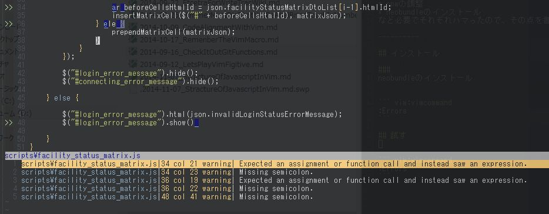
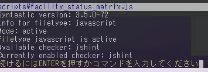

# 2014-11-07 VimのJavaScript開発環境を整える



JavaScriptで開発していて環境を整えなければ、
シンタックスチェックがないと死ぬ、ということになったので
Vimに入れてみましたというお話です。


## アジェンダ
1. JavaScript開発環境に必要なものとして
1. インストール
1. 試す


## JavaScript開発環境に必要なものとして

### シンタックスチェックの機構
自動でしてくれると良いよね。

これだけで十分。オムニ補完(サジェスト)とかはそれほど必要じゃない、と思う。
快適になるようだったら組み込もうぞ。


### すること

自動シンタックスチェック表示のプラグインである[Syntastic](https://github.com/scrooloose/syntastic)を入れて、javascriptのチェックライブラリとして[js.hintのノード](http://www.jshint.com/install/js.hint)
を入れる。

だけなのだけど、そのためには
* node.jsのインストール
* npmの調整
* neobundleのインストール
など必要でそれぞれハマったので、その点を書きます。


## インストール

### neobundle

[neobundle](https://github.com/Shougo/neobundle.vim)はプラグインをgithubからダウンロードしてくれたり、
更新をチェックしてくれたりするプラグイン。ずっと手動で各プラグインを入れて頑張っていたけれど、
Syntasticがどうも動いてくれないので、今回確実かつ便利にインストール出来る仕組みとして
待望の導入。昔neobundle自体の導入でハマって涙を飲んでいたので、今回サクッと出来て嬉しいな。

### Syntastic

neobundleを使ってインストール。\_vimrcに以下を記述して、vimを起動すると自動でインストールされる。

``` _vimrc
NeoBundle 'scrooloose/syntastic'
``` 

### node.js

[node.jsのサイト](http://nodejs.org/)からインストール。環境変数にpathを通すらしいのだが通らなく、動かなかった。
環境変数に以下を追加。

``` 
"C:\Program Files\nodejs"
``` 

### npm 

node.jsのパッケージ管理である[npm](https://www.npmjs.org/)はnode.jsのインストール時に同時にプラグインとしてついてくる。しかし起動するとフォルダパスが見つからないと怒られた。
なんか色々調べると


``` 
C:\Program Files\nodejs"C:\Users\[UserName]\AppData\Roaming\npm
``` 
のフォルダがなくて怒られているらしい。そんなにハマってる人いないっぽいので
インストールで失敗しているのだろう。フォルダを追加すると通るようになった。

### js.hint

node.jsのパッケージとしてのjs.jshintをダウンロードすると、syntasticが勝手に読み取ってくれるらしい。
node.jsをWindowsで起動するには[msys.git](http://msysgit.github.io/)等のbashが必要。幸いGitBashが入っていたので、コマンドを叩く。


``` 
$ npm install -g jshint
``` 

長かったぞえ。でも、これだけで環境が整った。後はVimを起動してjsファイルを開けば、
自動でシンタックスチェックが始まるよ。


## 試す

.jsファイルを開いて、Syntasticの設定を確認しよう。

``` vim:vimcommand
:SyntasticInfo
``` 




いい感じに設定されているね！


``` vim:vimcommand
:w
``` 

保存時に自動でチェックが走り、エラーがあればマークされる。
行番号がの左に領域が出来て">>"が表示されるので、気づきやすい、といえば気づきやすいけれど、
割と気付かなかった。出ているのに動かしてIEのF12のエラーで気づきました。

``` vim:vimcommand
:Errors
``` 


を打つとこんな風に派手に表示してくれるよ。やったね。

これを最低限コミット前に打って確認するようにすれば、構文エラーは防げるはず。

