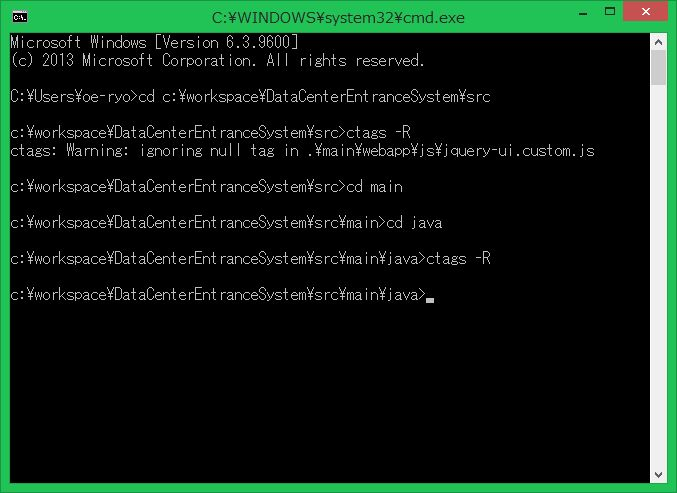

# Tagを使え

Tagを使わぬものVim使いにあらず、らしい。
くそう、初めて知ったぞ。
というわけで使ってみることにしました。
どうやらClassやMethod、EnumなんかをTagという形で判別し、実装元やなんやかや、ファイルを横断して飛んでってくれるらしいよ。

## 標準でできるのかな？
Vimで完結するものではなくて、ctagsを使うようである。
Windowsは[ここ](http://hp.vector.co.jp/authors/VA025040/ctags/)からダウンロードしたよ。適当にpathの通ってる場所にexeを置いたよ。

## 仕込み
Vimのcdでプロジェクトのrootに移動して、コマンド

    :!ctags -R

でやってみよう。
javascriptのファイルにあたってずっこけたよ。とりあえず、main/javaまで移動。再度。

一瞬で終わったよ。ほんとかよ。

## いいから使ってみようぜ！

宣言を探して、

    Ctrl + ]

うぉぉ！
こいつはスゴイ。
いとも簡単にやってのけてくれたよ。
そして、元のバッファはどっかいったよ。閉じられちゃったよ。
戻るときは

    Ctrl + t

で戻れる。

やった！

## 便利コマンド(便利)

|Command   |Explain                                                                             |
|:---------|:-----------------------------------------------------------------------------------|
|Ctrl + ]  |カーソル位置の単語のタグに対してジャンプ(バッファを閉じて開く。保存しておく必要あり)|
|Ctrl + t  |直前のタグに戻る(バッファが戻る)                                                    |
|g Ctrl + ]|複数候補がある場合に選択→ジャンプ。                                                |
|Ctrl + w }|カーソル位置の単語の定義を、スプリットで開く。これが一番使うはず。便利！            |

べんり！

